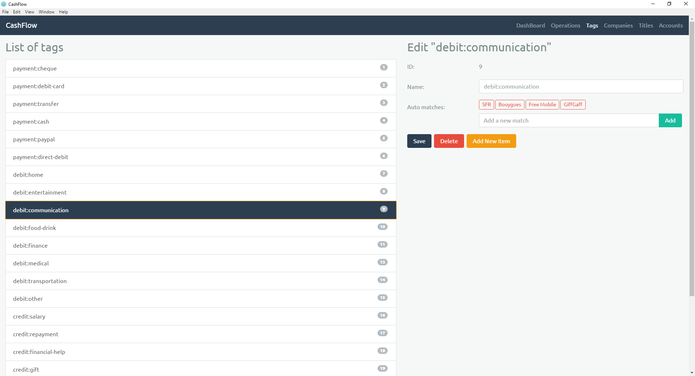

# CashFlow

## Information

Base of a software of monitoring cash bank accounts.

Technologies: NodeJS, Electron, TypeScript, Gulp, AngularJS 2, D3.js, NVD3.

Although the program is quite well advanced, it certainly requires several improvements in order to be used regularly. However, I no longer wish to update this program: I realized it in order to discover AngularJS 2, typescript, and D3.js. Being satisfied with my discoveries, I decided to stop developing the project.

## Installation/Run

- NodeJS required
- `npm install` (`electron` directory)
- `npm start`

## Screenshots

## Possible improvements

- Add "initialAccountBalance" setting to Account class/pages
- Dashboad filter Company+Title+Account
- Support Accounts in OperationsLineChartComponent
- Add dashboad chart with multiple accounts
- Add import plugin for other banks
- Feature future operations
- Feature tag budget
